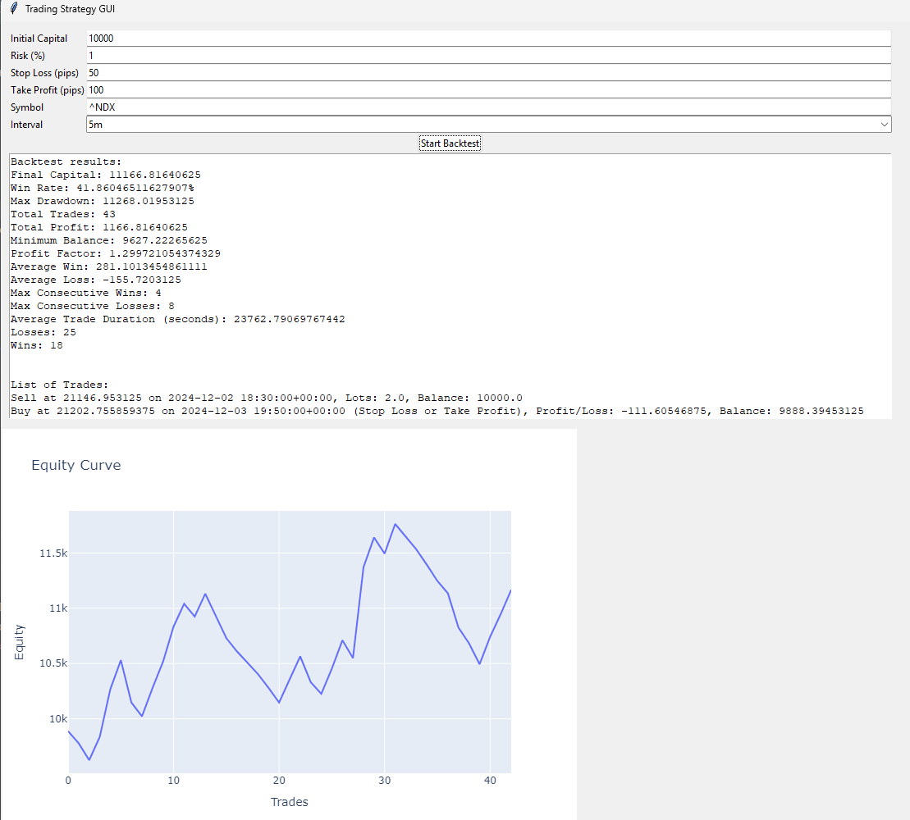

# Trading Strategy Backtester

This project is a trading strategy backtester implemented in Python. It includes a GUI for user interaction, a strategy for backtesting, and unit tests to ensure the correctness of the implementation.

## Project Structure

- `strategy.py`: Contains the `TradingStrategy` class which implements the trading strategy and backtesting logic.
- `main.py`: Entry point for the GUI application.
- `test_strategy.py`: Contains unit tests for the `TradingStrategy` class.
- `data_fetcher.py`: Fetches historical data using the `yfinance` library.
- `gui.py`: Contains the `TradingApp` class which implements the GUI using `tkinter`.

## Strategy Description

The trading strategy implemented in this project is based on the Volume Weighted Average Price (VWAP). The strategy aims to buy when the price is below the VWAP and sell when the price is above the VWAP, with additional risk management parameters such as stop-loss and take-profit levels.

## Requirements

- Python 3.x
- `pandas`
- `numpy`
- `yfinance`
- `tkinter`

## Installation

1. Clone the repository:
    ```sh
    git clone https://github.com/zaninifrancesco/trading-strategy-backtester.git
    cd trading-strategy-backtester
    ```

2. Install the required packages:
    ```sh
    pip install pandas numpy yfinance
    ```

## Usage

1. Fetch historical data:
    ```sh
    python data_fetcher.py
    ```

2. Run the GUI application:
    ```sh
    python main.py
    ```

## Running Tests

To run the unit tests, use the following command:
```sh
python -m unittest discover
```
